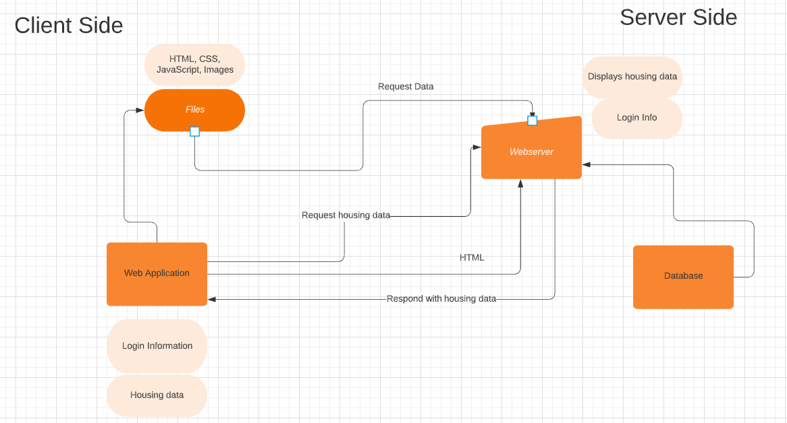

# INFO441 Final Project

## Project Description

Our target audience is UW students who are looking for on-campus housing or another location but within walking distance. We envision many students using this application to obtain suitable housing that includes considerations like safety, accessibility, amenities, decent spacing, and more.

Our application is targeted at a specific group of consumers (students), and unlike bigger apartment finding sites, we will include factors that college students care about displayed with a simply UI. For example, including a way to quickly find amenities and features such as high-speed internet, dedicated parking spots, and surrounding location hot spots.

We as students want to build this application because we understand the process of finding suitable housing and the struggles of finding an apartment that fits our specific needs.

## Architectural Diagram



## User Stories
| Priority      | User | Description      | Technical Implementation |
| ----------- | ----------- | ----------- | ----------- |
| P0 | Student | As a student, I want to find available apartments close to my college. | When accessing apartments from the database, add filters to a query based on user input of the distance away to show available listings stored in our database. |
| P0   | Dev | As a student, I want to live walking distance from campus and filter out apartments. | When accessing apartments from the database, retrieve query parameters from the sliders in the UI to fetch and filter the apartment data in the server. |
|P0| Dev | As a developer, we want to find apartment data for our users. | Hardcode a small amount of apartment data into MongoDB while we are still testing the functionality of our application. |
|P1|Student|As a student, I want to be able to quickly view the size and price of an apartment.| Create sliders for the users to adjust price and apartment size filtering. Create a GET endpoint that returns apartment information from the database to the client for each filtered apartment. |
| P2 | User| As a user, I want to be able to create an account to save my listings |  Create a GET request that returns profile information on log in to make sure the user is logged in to their account. Implement sessions that signal to the user that they have logged in and out of their account. Add a 'add listing' button on each apartment listings that when clicked saves the apartment listing to the user's 'saved' field in their user schema. |
| P2 | User | As a user, I want my data to be secure. | Use the microsoft-identity-express package to make sure a user must have a UW-NetId to log in to their profile and save listings. The user can visibly see if they are logged in as clicking the log in button on the landing page will display their username. The 'saved listing' button on the index page will also be missing if a user is not logged in. |


## Endpoints

**Authentication**

- /signin
  - Creates a new session for the user. Responds with a message to the user notifying that they have successfully logged in to their account.


- /signout
  - Destroys the session for the user. Responds with a message to the user notifying that they have successfully logged out of their account.


- /error
  - Respond to login and server-side errors.

- /unauthorized
  -   Respond with denied permission to unauthorized features.

**Users**

- GET /user
  - An endpoint for users to retrieve their account information and their saved listings. Once a user is logged on, the server responds with access to their profile.

```
{
  
  "username": "{username}",
  "saved": [{apt name}, {apt name}...]
}
```

- POST /user
  - Saves unique users to the database by their username.

- POST /users/saveApt
  - An endpoint for users to update their saved list of apartments.

- POST /users/unsaveApt
  - An enpoint for users to remove listings from their saved list of apartments.

**Apartments**

- GET /api/post
  -   The GET request uses the parameters given by the user and responds by accessing data from the database, returning an array of apartment data to the user that is exclusive to the filters given in the parameters.


## Database Schema

Apartments
```
{
    "placeName": String,
    "area": String,
    "size": Number,
    "distanceAway": Number,
    "price": Number,
    "description": String,
    "leasingterm": String,
    "roommates": Number,
    "features": String,
    "image": {data: Buffer,
      contentType: String}
}
```

Users

```
{
  "username": String,
    "saved": Array,
    "saved_date": Date
}
```
### Deploy Link
https://faayfinal441.azurewebsites.net/
